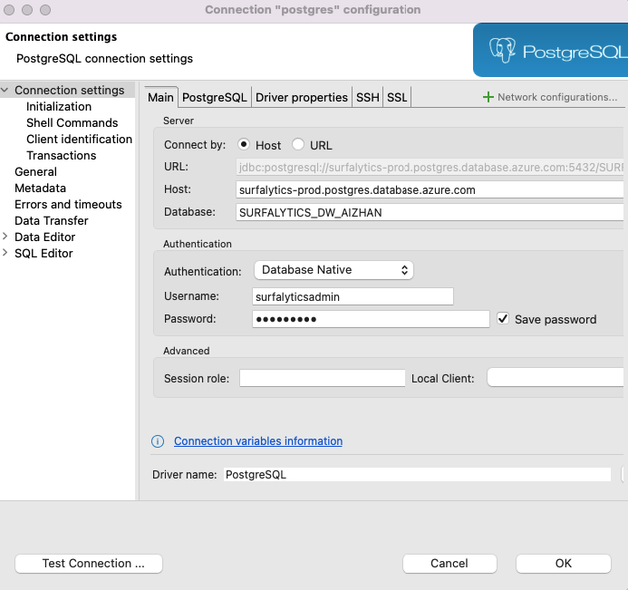
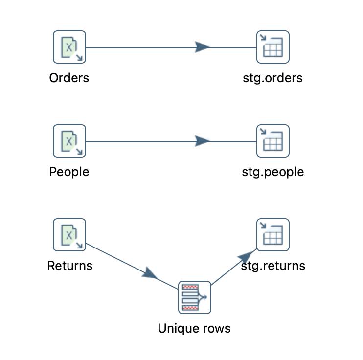
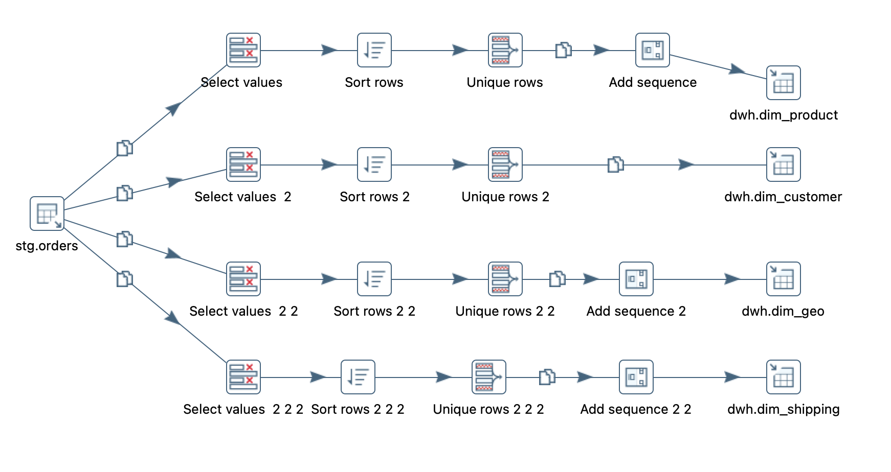

# Dimensional Modeling Project with Remote PostgreSQL DB on Azure

## Overview
This project demonstrates the implementation of a dimensional model on a remote PostgreSQL database hosted on Azure, using Pentaho Data Integration (PDI) for ETL processes. Dimensional modeling is a data modeling technique used to structure data warehouses for efficient querying and reporting. The project includes the design and deployment of star schema to support business intelligence and data analytics.

## Table of Contents
- [Getting Started](#getting-started)
- [Prerequisites](#prerequisites)
- [Project tasks](#project-tasks)

## Getting Started
To get a local copy of the project up and running, follow these simple steps.

### Prerequisites
- PostgreSQL client
- Azure account with a PostgreSQL database instance
- VSCode
- git
- Pentaho Data Integration (PDI) or any other ETL tool

### Project tasks
1. Clone the repo and access it using VS Code
2. Load data to PostgreSQL by building ETL using Pentaho DI:
   - Create DB/DWH to store the data
   - Load raw data to STG (staging)
   - Load dimensions to DWH (Data warehouse)
3. Next tasks are coming


### Task 1: Clone the repo and access it using VS Code
   **Open VSCode and launch the terminal:**
   - You can open the terminal by pressing ``Ctrl+` `` (backtick) or navigating to `View > Terminal`.
   **Clone the repository:**
   ```bash
   git clone https://github.com/aizhannna/data-projects.git
   ```

### Task 2: Load data to PostgreSQL**
  **Connect to PostgreSQL using DBeaver**
   #### Download and install DBeaver:
   1. Go to the [DBeaver download page](https://dbeaver.io/download/) and download the appropriate version for your operating system.
   2. Install DBeaver by following the installation instructions for your operating system.

   1. **Open DBeaver.**
   2. **Click on the `New Database Connection` button or navigate to `Database > New Database Connection`.**
   3. **Select `PostgreSQL` from the list of database drivers and click `Next`.**
   4. **Enter the connection details:**
   ```bash
      - Host: your-db-host
      - Port: 5432
      - Database: your-db-name
      - Username: your-db-user
      - Password: your-db-password
   ```
   5. **Click `Test Connection` to ensure that the connection details are correct. Click `OK` to save the connection.**

   

   #### In DBeaver create schemas STG and DWH for the tables by running below SQL Scripts:
   - Scriptis to create tables in STG schema to load the raw [data](./data) : [create_tables.sql](./SQL/create_tables.sql) 
   - Scriptis to create dimension tables in DWH schema to load the dictionary data: [create_dim_tables.sql](./SQL/create_dim_tables.sql) 
   #### ETL Process
   - The ETL (Extract, Transform, Load) process is handled by Pentaho Data Integration (PDI). The process involves extracting data from source (in our case the data is in Excel), transforming it into the desired format, and loading it into the PostgreSQL database on Azure. Jobs and Transformations are located in [ETL](./ETL) 
   - Running the ETL Process
      - Open Pentaho Data Integration (PDI).
      - Load the job file [ETL](./ETL/superstore_workflow_job.kjb) .
      - Configure the database connection:
      - Go to the Database Connections and set up a new connection using the details of your DB.
      - Run the job to execute the ETL process.

   
   

   - Open DBeaver and run the following queries to check the loaded data:
   ```bash
   select count(*)
   from stg.orders o ;

   select count(*)
   from stg.people p  ;
   
   select count(*)
   from stg.returns r ;

   select count(*)
   from dwh.dim_customer dc  ;

   select count(*)
   from dwh.dim_geo dg; 

   select count(*)
   from dwh.dim_shipping;
   ```
   Wait for the next tasks!
