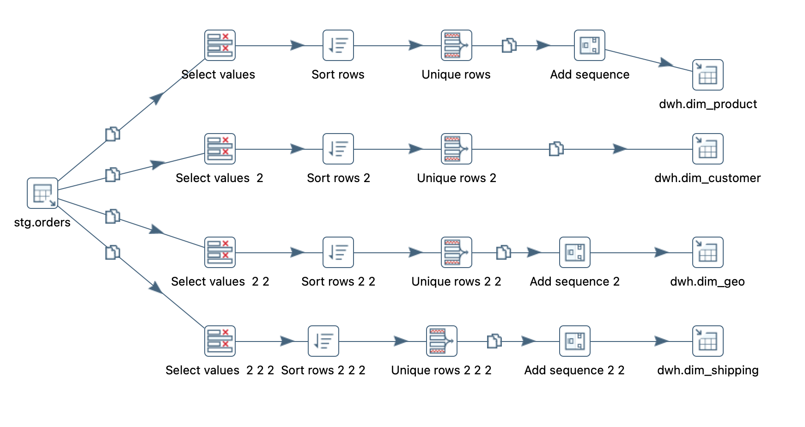

# Dimensional Modeling Project with Azure Postgre, dbt Core and Looker

## Overview
This project demonstrates the implementation of a dimensional model on a remote PostgreSQL database hosted on Azure, using Pentaho Data Integration (PDI) for ETL processes. Dimensional modeling is a data modeling technique used to structure data warehouses for efficient querying and reporting. The project includes the design and deployment of star schema to support business intelligence and data analytics.

## Table of Contents
- [Getting Started](#getting-started)
- [Prerequisites](#prerequisites)
- [Project tasks](#project-tasks)

## Getting Started
To get a local copy of the project up and running, follow these simple steps.

### Prerequisites
- PostgreSQL client
- Azure account with a PostgreSQL database instance
- VSCode
- git
- Pentaho Data Integration (PDI) or any other ETL tool
- python
### Project tasks
1. [Week 1](#week-1-clone-the-repo-and-access-it-using-vs-code): Clone the repo and access it using VS Code
2. [Week 2](#week-2-load-data-to-postgresql): Load data to PostgreSQL by building ETL using Pentaho DI:
   - Create DB/DWH to store the data
   - Load raw data to STG (staging)
   - Load dimensions to DWH (Data warehouse)
3. [Week 3](#week-3-build-models-using-dbt-core): Build models using dbt Core
   - Setup ```dbt Core``` and create new dbt project
   - Define and specify source tables in ```sources.yml```
   - Define `dev` and `prod` profiles in ```profiles.yml``` to deploy respectively to dev/prod schema or databases.
   - Build staging model using [Medallion Architecture](https://i-spark.nl/en/blog/dbt-naming-conventions-and-medallion-architecture/).
4. [Week 4](#week-4-add-pre-commit-and-compare-dbt-strategy-vs-dbt-config): Add pre-commit to the repo, compare dbt strategy and dbt config
   - Add pre-commit to your repo, to check YAML files, trailing whitespace and SQL.
   - Compare dbt strategy and dbt config https://docs.getdbt.com/docs/build/incremental-strategy
      - creating view
      - full table reload
      - incremental
   - Add github actions to be able to run pre-commit in CI i.e. when you create a PR, it will test the files.

### Week 1: Clone the repo and access it using VS Code
   **Open VSCode and launch the terminal:**
   - You can open the terminal by pressing ``Ctrl+` `` (backtick) or navigating to `View > Terminal`.
   **Clone the repository:**
   ```bash
   git clone https://github.com/aizhannna/data-projects.git
   ```

### Week 2: Load data to PostgreSQL**
  **Connect to PostgreSQL using DBeaver**
   #### Download and install DBeaver:
   1. Go to the [DBeaver download page](https://dbeaver.io/download/) and download the appropriate version for your operating system.
   2. Install DBeaver by following the installation instructions for your operating system.

   1. **Open DBeaver.**
   2. **Click on the `New Database Connection` button or navigate to `Database > New Database Connection`.**
   3. **Select `PostgreSQL` from the list of database drivers and click `Next`.**
   4. **Enter the connection details:**
   ```bash
      - Host: your-db-host
      - Port: 5432
      - Database: your-db-name
      - Username: your-db-user
      - Password: your-db-password
   ```
   5. **Click `Test Connection` to ensure that the connection details are correct. Click `OK` to save the connection.**

   

   #### In DBeaver create schemas STG and DWH for the tables by running below SQL Scripts:
   - Scriptis to create tables in STG schema to load the raw [data](./data) : [create_tables.sql](./SQL/create_tables.sql)
   - Scriptis to create dimension tables in DWH schema to load the dictionary data: [create_dim_tables.sql](./SQL/create_dim_tables.sql)
   #### ETL Process
   - The ETL (Extract, Transform, Load) process is handled by Pentaho Data Integration (PDI). The process involves extracting data from source (in our case the data is in Excel), transforming it into the desired format, and loading it into the PostgreSQL database on Azure. Jobs and Transformations are located in [ETL](./ETL)
   - Running the ETL Process
      - Open Pentaho Data Integration (PDI).
      - Load the job file [ETL](./ETL/superstore_workflow_job.kjb) .
      - Configure the database connection:
      - Go to the Database Connections and set up a new connection using the details of your DB.
      - Run the job to execute the ETL process.

   
   

   - Open DBeaver and run the following queries to check the loaded data:
   ```bash
   select count(*)
   from stg.orders o ;
   select count(*)
   from stg.people p  ;
   select count(*)
   from stg.returns r ;
   select count(*)
   from dwh.dim_customer dc  ;
   select count(*)
   from dwh.dim_geo dg;
   select count(*)
   from dwh.dim_shipping;
   ```
### Week 3: Build models using dbt Core
   **Setup `dbt Core` and create new dbt project (see [this link](https://docs.getdbt.com/docs/core/pip-install) for more)**
   1. Create a new virtual environment in a specific folder to namespace pip modules:
      ```bash
      python3 -m venv venvs/dbt_env       # create the environment
      ```
   2. Activate the same virtual environment
      ```bash
      source venvs/dbt_env/bin/activate     # activate the environment for Mac and Linux OR
      venvs/dbt_env\Scripts\activate            # activate the environment for Windows
      ```
   3. Use the following command to install `dbt core` and `dbt database adapter` to connect to Postgres:
      ```bash
      python3 -m pip install dbt-postgres
      ```
      You can check the dbt version and adapter that has been installed:
      

      **See this [link](https://docs.getdbt.com/docs/core/pip-install) for more information on how to install dbt Core.**
   4. Next step is to create project by running `dbt init project_name` then you should setup your        profile by answering to the questions as in the pictures below:
      
      
   5. Then run dbt `dbt debug` command to check the connection:
      

   **Define and specify source tables in `sources.yml`**
   1. Create `sources.yml` under  your project/models folder and specify source tables metadata as in    example below (see more [here](https://docs.getdbt.com/reference/source-configs)):
   ```bash
      sources:
      - name: superstore
         description: Data from Superstore dataset
         database: SURFALYTICS_DW_AIZHAN
         schema: raw
         tables:
            - name: orders
            description: Raw orders data
            - name: people
            description: Raw data for regional managers
            - name: returns
            description: Raw data for returned orders
   ```
   **Build staging model using [Medallion Architecture](https://i-spark.nl/en/blog/dbt-naming-conventions-and-medallion-architecture/)** - in context of `dbt` it is just folders:
   - dbt_superstore/models/
      - bronze
      - silver
      - gold

   1. Create the staging or bronze model to pull the raw data from source tables and make `config` in the top of model to specify setttings such as `aliasl`, `strategy`, etc. See [dbt documentation](https://docs.getdbt.com/reference/model-properties) for details. Go to see [dbt_superstore/models](dbt_superstore/models/bronze)

      

   **Define `dev` and `prod` profiles in ```profiles.yml``` to deploy respectively to dev/prod schema or databases.**
   1. Run `dbt debug` to find location of `profiles.yml` and then click to the path to open the file:
      

   2. Define `dev` and `prod` connection details to deploy the models to your datawarehouse for both  `dev`  or `prod` environments. Make sure to avoid `tab` indentations, you should use `spaces` for indentation in `profiles.yml`.
      ```bash
      dbt_superstore:
      target: dev #default target environment if you don't specify otherwise when running the models
      outputs:
         dev:
            dbname: SURFALYTICS_DW_AIZHAN
            host: hostname
            pass: ***** #put you password
            port: 5432
            schema: stg #schema name
            threads: 1
            type: postgres
            user: surfalyticsadmin
         prod:
            dbname: SURFALYTICS_DW_AIZHAN
            host: hostname
            pass: ***** #put you password
            port: 5432
            schema: stg #schema name
            threads: 1
            type: postgres
            user: surfalyticsadmin
      ```
   3. Run and deploy the models to the datawarehouse in `dev` environment:
      ```bash
      dbt debug # check the connection
      dbt compile # to compile the models
      dbt run #to run the models
      ```
      
      

   4. You should be able to see the views in your datawarehouse in stg schema (`dev` environment):
      

### Week 4: Add pre-commit and compare dbt strategy vs dbt config
   This week we're still working in bronze(stg) model.
   1. Add pre-commit to your repo, to check YAML files, trailing whitespace and SQL.
   2. Compare dbt strategy and dbt config https://docs.getdbt.com/docs/build/incremental-strategy
   - creating view
   - full table reload
   - incremental
   we are using `dbt-postgres` and it supports - append, merge, delete+insert: copy the same model and try these 3 options and document the SQL difference about these 3 approaches
   3. Add github actions to be able to run pre-commit in CI i.e. when you create a PR, it will test the files.


   Wait for the next tasks!
